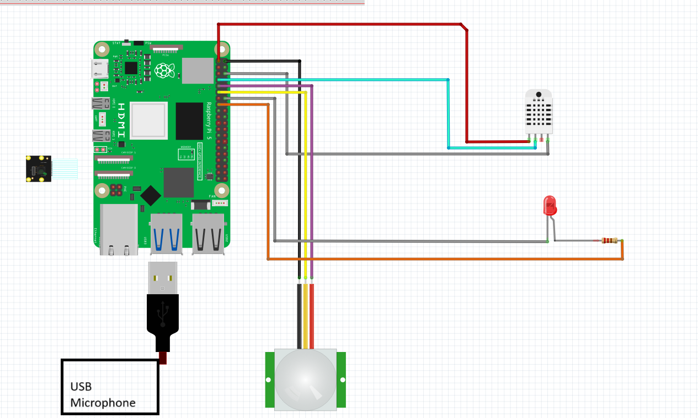

# 🤖 JARVIS Lite - AI Home Assistant

  
*Demo: JARVIS detecting a person, responding to commands, and controlling lights (replace with actual demo GIF or screenshot)*

---

**JARVIS Lite** is a Raspberry Pi-powered AI assistant designed for smart home environments. It combines voice recognition, face identification, object detection, environment monitoring, and messaging alerts in a cohesive offline-first system.

---

## 🚀 Features

- 🎙️ **Voice Control** — Natural language understanding via Whisper + LLaMA
- 💡 **Home Automation** — Turn lights on/off, check temperature & humidity, and get time or weather updates
- 👤 **Facial Recognition** — Identify authorized users and detect unknown individuals
- 📷 **Smart Security Camera** — PIR motion detection + YOLOv8 for real-time object/person detection
- 🛡️ **Security Alerts** — Sends Telegram photo alerts upon unknown face detection
- 🎵 **Media Playback** — Local music playback on voice command
- 🌐 **Real-Time Info** — Fetches news headlines and weather via web APIs
- 🔌 **Offline-First** — LLaMA and Whisper run locally (no cloud required)

---

## 🧰 Hardware Requirements

| Component                  | Description                                |
|---------------------------|--------------------------------------------|
| Raspberry Pi 4            | Recommended (3B+ may also work)            |
| Pi Camera Module          | For photo and video capture                |
| PIR Motion Sensor         | To detect motion (GPIO-based)              |
| DHT11 Sensor              | For temperature and humidity               |
| LED + Resistor            | Connected to GPIO22 for light automation   |
| Microphone (USB or I2S)   | For capturing voice commands               |
| Speaker or Audio Output   | For text-to-speech playback                |

---

## 📦 Software Dependencies

Install all required Python packages:

```bash
sudo apt update && sudo apt install python3-pip portaudio19-dev libatlas-base-dev espeak ffmpeg
pip install opencv-python face-recognition pygame sounddevice numpy whisper pyttsx3 requests gpiozero pillow adafruit-circuitpython-dht
pip install ultralytics
pip install git+https://github.com/openai/whisper.git
pip install python-telegram-bot
```
##  Installation & Setup
### Clone the repository

```bash
git clone https://github.com/Eya-Ben-Charrada/jarvis-smart-assistant.git
cd jarvis-smart-assistant
```
### Directory Preparation
Create a known_faces/ folder:
```bash
mkdir known_faces
```
Add clear, front-facing JPG or PNG photos of authorized users.

### Set Telegram Credentials
Edit jarvis.py and replace the placeholders: 
```bash
TELEGRAM_TOKEN = "your_bot_token"
CHAT_ID = "your_chat_id"
```

### Download LLaMA Model
Download a quantized .gguf model like TinyLLaMA:
```bash
wget https://huggingface.co/TheBloke/TinyLlama-1.1B-Chat-v1.0-GGUF/resolve/main/tinyllama-1.1b-chat-v1.0.Q4_K_M.gguf
mkdir ~/llama_models
mv tinyllama-1.1b-chat-v1.0.Q4_K_M.gguf ~/llama_models/
```

### Launch LLaMA Server
In another terminal window:
```bash
cd ~/llama.cpp/build/bin
./llama-server -m ~/llama_models/tinyllama-1.1b-chat-v1.0.Q4_K_M.gguf --port 8080
```

### Run JARVIS
```bash
python3 jarvis.py
```

# 🎤 Voice Command Examples

| Command                   | Action                              |
| ------------------------- | ----------------------------------- |
| “Turn on the light”       | Turns GPIO LED on                   |
| “Take a photo”            | Captures photo via Pi Camera        |
| “Activate security mode”  | Enables motion + face detection     |
| “What's the temperature?” | Reads DHT11 sensor                  |
| “Play music”              | Plays MP3 from local folder         |
| “Tell me the news”        | Fetches latest headlines (NewsAPI)  |
| “Shutdown” or “Stop”      | Gracefully shuts down the assistant |


# 🛠️ Project Structure
```bash
jarvis-smart-assistant/
├── LICENSE
├── README.md
├── jarvis.py                  # Main assistant logic
├── requirements.txt           # All Python dependencies
├── known_faces/               # Images of known users
├── Music/                     # Folder with MP3 files
├── test_face_recognition.py   # Optional: face recognition tester
└── docs/                      # Additional documentation
```

# 🖼️ System Architecture
```bash
                    +----------------------+
                    |     Microphone       |
                    +----------------------+
                              |
                              v
                  [Whisper Voice Transcription]
                              |
                              v
                     [Intent Classification]
         +-----------+-----------+--------------+--------------+
         |           |           |              |              |
    Smart Home   Camera     Weather/News    Face ID      LLaMA LLM
     Actions      & PIR        Queries     (YOLO + FR)   (Local Chat)
         |           |           |              |              |
        GPIO     Image/Alert   APIs        Security     Contextual
       Light      + Telegram                Mode        Conversation

```

# 🧪 Troubleshooting
## 1. Telegram alerts not working?
- Double-check your token and CHAT_ID

- Run ping api.telegram.org to test connectivity

## 2. Face recognition not detecting?
- Use clear, front-facing photos with good lighting

- Test with:
```bash
python3 test_face_recognition.py
```

## 3. Audio not captured?
- Check your mic:
```bash
arecord -l
```

- Adjust volume:
```bash
alsamixer
```


## 🛠️ Wiring Diagram

Below is the connection diagram for the Raspberry Pi and connected components:




